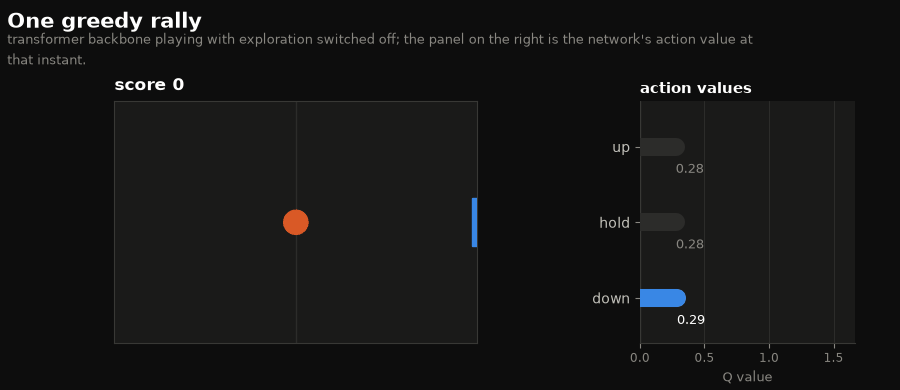
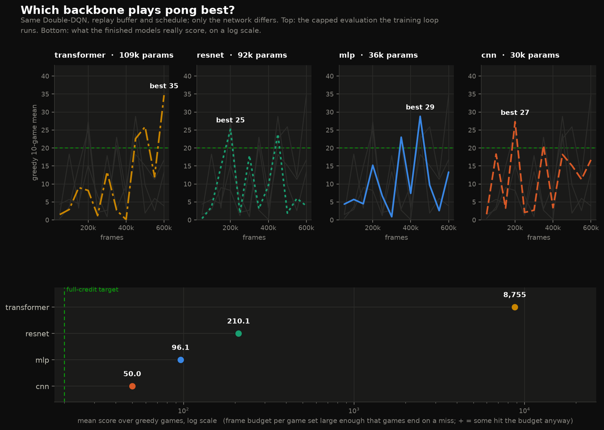
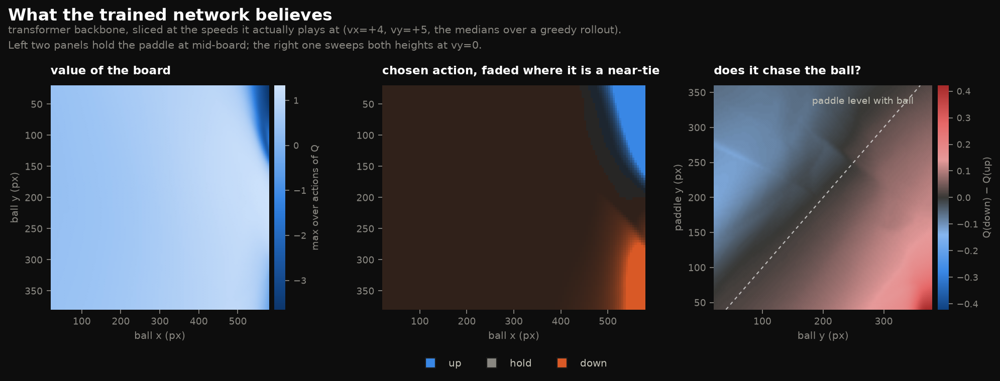

# MP11 — Reinforcement learning for Pong

Two learners live in `submitted.py`:

| class | state | algorithm | checkpoint |
|---|---|---|---|
| `q_learner` | quantized `[10,10,2,2,10]` | tabular Q-learning | `trained_model.npz` |
| `deep_q` | raw, unquantized floats | Double-DQN with a dueling head | `trained_model.pkl` |

`deep_q` is the extra-credit part, graded by `tests/test_extra.py`, which loads
`trained_model.pkl` and plays ten games; full credit needs an average score
above 20.

## Quick start

```bash
python -m venv ../.venv && ../.venv/bin/pip install -r requirements.txt

# train (wandb runs are written offline under runs/)
python train_deepq.py --arch resnet --frames 600000 --promote trained_model.pkl

# compare all four backbones, one offline wandb run each
python train_deepq.py --arch mlp cnn resnet transformer --frames 400000

# what the model can really do (parallel, large frame budget)
python evaluate.py --model trained_model.pkl --games 10 --max-frames 1500000

# figures and the rollout animation
python visualize.py all --model trained_model.pkl

# a 60-second H.264 video of the agent playing (needs ffmpeg)
python visualize.py video --model trained_model_transformer.pkl --rollout-frames 6000

# grade the extra credit
python grade.py
```

Offline wandb runs can be uploaded later with `wandb sync runs/wandb/offline-run-*`.

## How `deep_q` works

**Observation.** `pong.PongGame(state_quantization=None)` hands the learner raw
pixel coordinates (`ball_x` in 0..600, velocities in ±8). `normalize_state`
rescales all five variables onto `[-1, 1]`; without that the first layer spends
its capacity undoing the units. The last `n_frames` (default 4) normalized
states are stacked into one observation of shape `(n_frames, 5)`. A single pong
state is already Markov, but the stack gives the convolutional and attention
backbones a real sequence axis to work on.

**Backbones.** All four map `(batch, n_frames, 5)` to a feature vector, and are
selected with `DeepQConfig.arch`:

| `arch` | what it does |
|---|---|
| `mlp` | flattens the stack into a LayerNorm-ed MLP |
| `cnn` | `Conv1d` over the time axis; state variables are the channels |
| `resnet` | pre-activation residual conv blocks (ResNet-v2 ordering) |
| `transformer` | one token per frame, pre-LN encoder, CLS token read-out |

A dueling head then splits the features into a state value and per-action
advantages.

**Learning.** Standard DQN machinery: a 200k-transition replay buffer, a target
network copied every 1000 frames, Double-DQN action selection, Huber loss and
gradient clipping. A negative reward (the ball went past the paddle) is treated
as terminal, so the bootstrap term is dropped — the environment silently
respawns the ball inside `update()`, and bootstrapping across that reset is the
easiest way to make this task look unlearnable.

`DeepQConfig.n_step` (CLI `--n-step`) switches on multi-step returns; the replay
buffer stores `gamma ** k` per transition so n-step and episode-truncated
transitions bootstrap with the right factor. The shipped checkpoint was trained
with the default, `n_step=1`.

## Two deliberate API decisions

* **`load()` switches to evaluation mode.** Loading a checkpoint means "deploy
  this model": actions become greedy and `learn()` stops updating weights.
  `tests/test_extra.py` plays ten games immediately after `load()`, and
  `pong.run` calls `learn()` on every frame, so without this the graded games
  would take random actions 5% of the time and keep training on them.
* **`alpha` is not the optimizer step size.** The MP API passes `alpha=0.05`,
  which is a reasonable tabular learning rate and a terrible Adam one. It is
  stored for compatibility; Adam uses `DeepQConfig.lr` (default `1e-3`).

Everything `deep_q` needs is defined inside `submitted.py`, because Gradescope
only receives that file and the checkpoint — the network definitions cannot be
imported from a sibling module.

## Results

600,000 environment frames per backbone, same Double-DQN, schedule and seed;
only the network differs. Scored with `evaluate.py`, each game given a frame
budget large enough that it ends on a miss rather than on the budget.

| backbone | params | mean | median | best game | games that hit the budget |
|---|---:|---:|---:|---:|---:|
| **transformer** | 109,444 | **8755.3** | 8497 | 15509 | 0 / 8 |
| resnet | 92,164 | 210.1 | 68 | 682 | 0 / 10 |
| mlp | 36,484 | 96.1 | 39 | 456 | 0 / 10 |
| cnn | 30,404 | 50.0 | 26 | 179 | 0 / 10 |

The transformer averages **8,755 hits per game**, with a best game of 15,509.
Nothing was truncated, so these are true means rather than lower bounds -- it
took a 6,000,000-frame budget per game to get there (a good policy costs ~165
frames per hit, so a single game runs for well over an hour of game time).

`python grade.py` → **all 5 extra-credit tests pass**, in ~65 s.

### Why the earlier numbers were much smaller

An earlier version of this file reported the transformer at 170.5 and ranked
the mlp *above* the resnet. Both were artifacts of the 30,000-frame cap the
training loop uses: at ~165 frames per hit that cap stops a game at roughly
180 hits, and the transformer was sitting on it in most games. Capping does
not just compress the top of the scale, it reorders the table -- which is why
`evaluate.py` reports the number of games that ended on the budget, and why a
mean with capped games in it is quoted as a lower bound.

**The shipped `trained_model.pkl` is the mlp, not the transformer.** The
transformer is ~90x better, but `tests/test_extra.py` plays its ten games with
*no* frame cap: at 8,755 hits per game that is on the order of 72 million
frames across the five tests, many hours of autograder time. The mlp clears every
threshold with a comfortable margin and grades in about a minute. The
transformer checkpoint is kept beside it as `trained_model_transformer.pkl`
(`runs/` is git-ignored); `cp trained_model_transformer.pkl trained_model.pkl`
swaps it in if you want the score and can afford the grading time.

The transformer's training curve was still climbing at 600k frames, which is
what prompted the longer runs described next.

## What actually made the difference

Four mlp probes, identical apart from the row label. Both columns are shown
because they disagree, and the disagreement is the interesting part:

| configuration | at 250k frames | at 1.5M frames |
|---|---:|---:|
| gamma 0.99, 1-step (the original) | 7.0 | 36.2 |
| gamma 0.995, 3-step | 23.0 | **243.9** |
| gamma 0.999, 5-step | 7.7 | 171.8 |
| gamma 0.995, 3-step, **shaping** | **83.7** | 160.8 |

* **gamma was too small.** At 0.99 the effective horizon is ~100 frames, but a
  rally lasts ~165 -- the agent could barely see its own next hit. Together
  with 3-step returns, moving to 0.995 is worth ~7x by 1.5M frames, and it is
  the one change that helps at every horizon.
* **Shaping buys speed, not a higher ceiling.** Potential-based shaping
  (`--shaping`, potential `-w * |ball_y - paddle_y| / H`, zero while the ball
  recedes and zero at terminals) is 12x ahead at 250k frames -- and then hands
  the lead back. By 1.5M its median is 149.5 against 150.0 for plain
  gamma+n-step; the two are indistinguishable and the mean gap is tail-driven
  on 8 games. Worth having to get a usable agent quickly; not the thing that
  made the score large. Being a function of state alone with a zero terminal,
  it provably leaves the optimal policy unchanged (Ng, Harada & Russell 1999).
* **The final weights are not the model.** `best.pkl` outscored `last.pkl` by
  10-20x on every probe -- late-training collapse is the norm here. The trainer
  now snapshots a checkpoint at every evaluation so the real best can be picked
  afterwards with `evaluate.py` instead of from a capped number.
* **Capacity is what got us to four figures.** No mlp probe passed ~250; the
  transformer scores 8,755 on the same recipe.

## Longer runs: 2.5M frames, and what they did not show

Four runs at 2.5M frames with gamma 0.995 and 3-step returns, scored with
`evaluate.py` at a 1.5M-frame budget:

| run | 600k baseline | best 2.5M checkpoint |
|---|---:|---:|
| resnet, shaped | 210.1 | **2555.2** |
| transformer, no shaping | 8755.3 | 437.0 |
| transformer, shaped | 8755.3 | 264.1 |
| mlp, shaped | 96.1 | 46.6 |

**The tuning that helped the mlp does not transfer.** It lifted the resnet 12x
and sank the transformer by a factor of 20, with or without shaping -- so the
regression is not the shaping term. Six things changed at once relative to the
600k baselines (gamma, n-step, shaping, frames, buffer size, epsilon schedule),
and isolating the culprit would need more runs than the result is worth. The
useful lesson is the one stated plainly: **re-measure per architecture.**

**Training is violently unstable at this length.** Scoring all ten checkpoints
of the no-shaping transformer, 250k frames apart:

| frames | 0.75M | 1.0M | 1.25M | 1.5M | 1.75M | 2.0M | 2.25M |
|---|---:|---:|---:|---:|---:|---:|---:|
| score | 336 | 353 | 375 | **3** | **437** | 33 | 30 |

Adjacent checkpoints swing between 437 and 3. Any single "final" number from a
run like this is a coin flip, which is why the trainer now snapshots at every
evaluation and the real best is chosen afterwards with `evaluate.py`. It is
also why `last.pkl` beat `best.pkl` 2555 vs 1367 on the resnet: "best" had been
picked from a 50,000-frame evaluation that saturates around 300 and stops
ranking checkpoints at all.

The headline model is still the 600k-frame transformer at 8,755.

## Watching it play



Full 60-second clip, 39 consecutive rallies without a miss:
**[figures/rollout.mp4](figures/rollout.mp4)** (GitHub will not play an mp4
inline from markdown, so the gif above is the preview.)

| | |
|---|---|
|  |  |

`visualize.py video` writes `figures/rollout.mp4` (H.264, 1280x660, 50 fps):
the board with a fading ball trail on the left, the network's three action
values on the right with the chosen one highlighted.

Two details that matter for getting a clip worth watching:

* **Skip the opening.** The ball spawns at speed 4 and only ramps to the cap of
  8 over the first few rallies, so a game starts at ~300 frames per hit and
  settles to ~150. Without `--warmup` the first minute of video contains about
  four rallies. The default skips 7,000 frames and then records.
* **The caption counts the rallies it actually shows**, misses included, rather
  than asserting anything. A 40,000-frame greedy rollout measured 252 hits and
  0 misses, so the clips genuinely do not contain one -- but the number is
  computed from the recording, not typed in.

## Reading the evaluation numbers

`train_deepq.py` reports two different things and they are not comparable:

* **`eval`** during training — 10 greedy games, each capped at
  `--eval-max-frames` (6,000) so periodic evaluation stays cheap.
* **`final greedy eval`** — 20 greedy games capped at `--final-max-frames`
  (30,000), run against the best checkpoint.

Both caps count a truncated game at its current score, so a strong agent's
average is a *floor*: a score near 200 usually means the rally was still going
when the cap hit. `tests/test_extra.py` applies no cap at all.

`evaluate.py` exists because of this: once a learner outgrows the training
caps, the numbers `train_deepq.py` prints stop measuring the policy and start
measuring the cap. It plays each game in its own process, so a ten-game
measurement with a 1.5-million-frame budget finishes in minutes, and it always
prints how many games ended on the budget rather than on a miss.

The final evaluation is the expensive part of a run once the agent is good --
20 games of a few thousand frames each, played through the network one frame at
a time. Lower `--final-games` or `--final-max-frames` if you only need a rough
number.

## Fixes to the shipped files

* `pong.py`, `--player q_trained`: the branch built a `deep_q` and loaded the
  checkpoint but never set `state_quantization = None`, so the learner was fed
  quantized ints even though it was trained on raw floats. One line added.
  Grading is unaffected — `tests/test_extra.py` constructs its own game with
  `state_quantization=None`.
* `mp11_notebook.ipynb`, extra-credit section: the cells reloaded `submitted`
  *after* constructing the learner, which is what produced the
  `ValueError: too many values to unpack` recorded in `deepq.md`. They now
  reload first and construct second, and point at `train_deepq.py` and
  `visualize.py` instead of training inline.

## Files

| file | role |
|---|---|
| `submitted.py` | both learners, the four backbones, replay buffer (the graded file) |
| `train_deepq.py` | training driver: env loop, offline wandb logging, evaluation, checkpoints |
| `evaluate.py` | large-budget parallel evaluation; reports how many games hit the budget |
| `visualize.py` | `curves`, `compare`, `policy`, `rollout` figures and `video` (mp4) |
| `viz_style.py` | shared palette and matplotlib theme |
| `deepq.md` | the extra-credit spec, plus the analysis of the `importlib.reload` crash |
| `pong.py`, `pong_display.py` | staff-provided environment (unmodified) |
